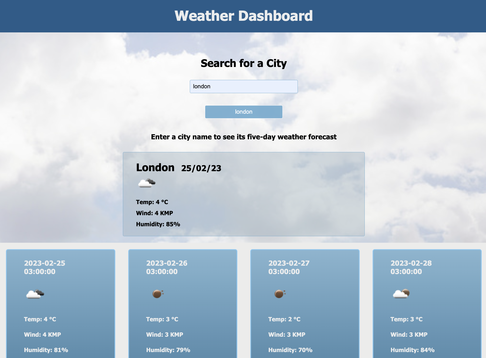

#  Weather Dashboard

## Description
This application enables a user to view the current weather of a city along with the following 5-day weather forecast.
When a user searches for a city they are presented with current and future conditions for that city and that city is added to the search history.
 
 The search displays the current weather conditions for that city they are presented with as well as:
    * The date
    * The temperature
    * The humidity
    * The wind speed

When a user click on a city in the search history they are again presented with current and future conditions for that city

## Usage

The following image shows the web application's appearance and functionality:

## Technologies

I have used the following technologies to create the application: HTML CSS, JavaScript and jQuery 
I have also used [5 Day Weather Forecast API](https://openweathermap.org/forecast5) to retrieve weather data for cities. 
The weather app uses local storage to save and retrieve previous searches

## Link
To View Deployed Site [Click Here](https://ayahxsheikh.github.io/weather-app/)

